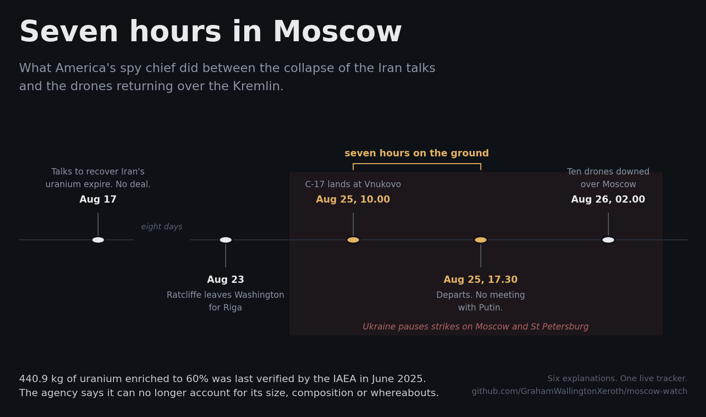
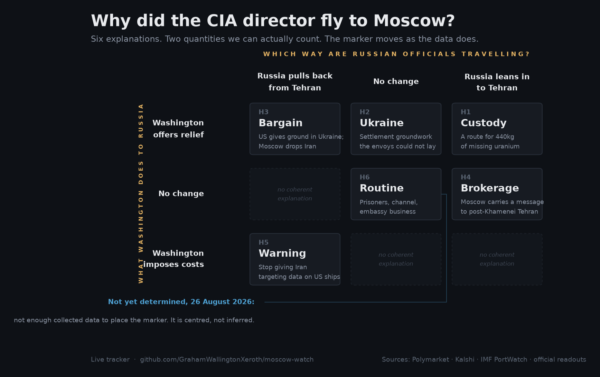
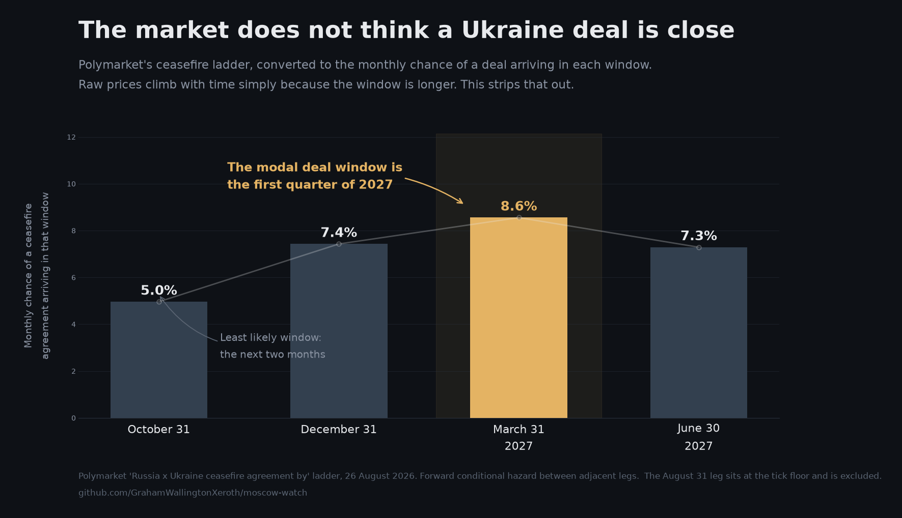

# What do you send a spy chief to do?

*A rare American intelligence visit to Moscow has six plausible explanations. Public data
will narrow them.*

---

On August 17th the negotiating window meant to end the Iran war expired without an
agreement. Both governments had by then described the deal as effectively dead. Eight days
later, on August 25th, John Ratcliffe, the director of the CIA, landed at Vnukovo airport
outside Moscow aboard an American air-force C-17. He had flown to Riga two days earlier and
crossed from there. He spent roughly seven hours on the ground, met Russian intelligence
officials, and left at half past five in the afternoon. He did not see Vladimir Putin, who
was briefed afterwards.

Somewhere between those two dates sits about 440kg of uranium enriched to 60%, which
neither the International Atomic Energy Agency (IAEA) nor Washington can presently account
for.

The coincidence may mean nothing. Most do. But the record of what was said in Moscow is
unlikely to be declassified within the working lifetime of anyone now reading about it, and
that is the situation in which speculation flourishes and is never marked against
reality. The alternative is to set out, before the evidence arrives, the small number of
things the visit could plausibly have been about, and to identify what each would leave
behind in data that anyone can check.

## Seven hours at Vnukovo

The visit itself is well attested. CBS reported it first; Axios confirmed it; RFE/RL
obtained its own confirmation from American officials. Flight trackers caught the aircraft
on both legs.

Washington told Kyiv that a senior delegation was travelling and asked Ukraine to suspend
strikes on Moscow and St Petersburg while it was there. Ukraine agreed to a pause covering
August 24th to 26th, though it was not initially told who was in the delegation. Drones
were over Moscow again within hours of the C-17's departure; the mayor reported ten shot
down at two o'clock on the morning of the 26th. A full day after the visit Ukraine had
still not received the debrief it was promised.

Mr Trump confirmed the trip on August 26th and called it "sort of semi-routine. I hate to
disappoint people." Asked whether it concerned warning Russia against testing NATO, or
Iranian sanctions, he replied: "None of the above." In the same conversation he said that
"something may come out of it" and that his administration was working hard to end the war
in Ukraine. The Kremlin confirmed contacts with the intelligence services and called the
episode a positive development. The CIA has said nothing whatever.

Two details have been widely assumed and neither has been reported. The first is the
identity of Mr Ratcliffe's counterpart. An established channel exists with Sergei
Naryshkin, head of the Foreign Intelligence Service, but no outlet has named anyone, and
Dmitry Peskov's formulation was simply "the intelligence services". The second is the
length of the meeting. Seven and a half hours is the time the aircraft spent on the ground,
transit across Moscow included.

A correction is also in order, since the error is already circulating. The previous CIA
director to visit Moscow was William Burns, in November 2021. He met Nikolai Patrushev and
Mr Naryshkin in person; his contact with Mr Putin was a telephone call. Neither director
has been granted an audience with the president.

## The wrong question

What was discussed is unanswerable and, more awkwardly, untestable. A better question sits
behind it.

Washington already has a Russia channel, and it is not the CIA. Steve Witkoff and Jared
Kushner met Mr Putin in Moscow in January and were expected back; Russian officials have
said so for weeks. Their planned trip to Ukraine in the week of August 24th was postponed,
reportedly because Mr Trump wanted his envoys close at hand over the unresolved Iranian
standoff. The interesting question is therefore not why America is talking to Russia, but
why it sent this particular man.

Only a few kinds of business require an intelligence chief rather than a diplomat.
Deniability is one: nothing is signed, minuted, or has to be characterised to Congress, to
allies or to Tehran. Verification is another, and it is underrated. An intelligence service
can independently establish whether a claim about physical material is true; an envoy must
take the other side's word. Access matters too, since Russia's relationship with Iran, and
in particular the targeting support that is the sorest point between Moscow and Washington,
runs through the security services rather than the foreign ministry. Then there is the
ordinary business of the trade: prisoners, warnings and the maintenance of a line that has
been largely dormant since 2021.

Each explanation below is an answer to that question. Each, if true, leaves a different
residue over the following weeks.

## Six ways to read a flight

The first and most likely is routine channel business: prisoners, a counter-terrorism
warning, embassy staffing (there is still no American ambassador in Moscow) or simply
keeping a line open. Mr Trump called the trip semi-routine and Mr Peskov called it
positive. Seven hours on the ground with no presidential meeting fits this reading more
comfortably than it fits anything dramatic. It is the explanation the others must beat.

The second is Ukraine: groundwork for a settlement that the diplomatic track has failed
to lay, trilateral talks having been suspended since February. Mr Trump tied the visit to
ending the war in the same breath as he called it routine. Against this, Ukraine's military
intelligence said on August 18th that Russia showed no sign of readiness for a ceasefire,
and briefing one's partner a week late is an unusual way to negotiate on their behalf.

The third is a warning. In March three separate reporting lines, from the Washington
Post, from RFE/RL with its own sourcing and from CBS with a third, established that Russia
had supplied Iran with the locations of American warships and aircraft. The matter has
never been resolved. A warning delivered service to service is deniable and carries the
useful implication that you know exactly what the other side is doing. Against it, Mr Trump
was asked this directly and said none of the above, and Mr Peskov described the meeting as
positive, which is not how such messages are usually received.

The fourth is the bargain that attracted most attention in the days after the visit:
Washington gives Moscow room in Ukraine, Moscow abandons Tehran. It is a coherent trade and
both presidents need an exit from a war they chose. It is also the explanation that the
public record currently argues against. On August 17th, eight days before the trip,
American intelligence-sharing with Ukraine was reported restored to full levels, and
Ukrainian deep strikes are running at their highest tempo of the war. The only restraint on
record is a 48-hour pause covering the airspace an American military aircraft was about to
fly into, which Ukraine ended the moment it left. That is force protection rather than a
concession.

The fifth is brokerage. Washington has no working channel to a Tehran that lost Ali
Khamenei in the opening strikes of the war in February. Moscow has one. Oman and Qatar are
already mediating over the Strait of Hormuz, so third-party brokerage is the mode in which
this negotiation is being conducted. Asking an adversary to carry a message is not
something a government announces.

The sixth concerns the uranium.

## Missing, presumed buried

In June 2025 the IAEA verified Iran's stockpile at 440.9kg of uranium hexafluoride enriched
to 60%, alongside larger quantities at lower enrichment. Sixty per cent is not weapons
grade, but the remaining step is short.

The war began on February 28th 2026 and IAEA verification in Iran stopped that same week.
No inspectors have been in the country since. In its report this June the agency stated
that it cannot provide any information on the current size, composition or whereabouts of
the stockpile. Rafael Grossi, its director-general, estimated publicly in April that a
little over 200kg of the 60% material was at Esfahan, and was careful to call the figure an
estimate. Abbas Araghchi, Iran's foreign minister, says the material lies under rubble.
Nobody is in a position to check. It is, by a distance, the most dangerous unaccounted-for
material in the world.

What follows is on the record and has attracted remarkably little notice. In mid-April Mr
Peskov said that Moscow had offered to take the uranium, adding that the offer was not on
the negotiating table because Washington had shown no interest. Two days later Mr Trump
said America would recover the material and bring it home. The day after that Alexei
Likhachev, the head of Rosatom, said his agency stood ready to assist with transferring and
transporting it, and invoked the precedent explicitly: in December 2015, under the nuclear
deal, Russia took custody of roughly 11 tonnes of Iranian enriched uranium, a step John
Kerry called among the most significant in the agreement. On July 6th Mr Likhachev said
Rosatom's involvement would probably be required.

There is thus a documented Russian offer, a documented American refusal, a working
precedent and a negotiating window that collapsed on August 17th. Eight days later the
director of the CIA was in Moscow.

The connection between those facts is inference, and it is the weakest link in the chain.
No outlet has reported the agenda of the meeting. Everything preceding that step is
documented; that step is not, and it would be dishonest to present it otherwise.

The file does, however, have peculiar requirements. Somebody must establish whether Iran's
account of buried material is true, which is an intelligence question rather than an
inspection one. Any custody arrangement needs verification of a kind an agency can supply
and a foreign ministry cannot. And Washington rejected the Russian offer publicly four
months ago, which makes accepting it visibly rather awkward. Anyone wishing to reopen that
question quietly would send the man who went.

## Telling them apart

The six explanations disagree about the future in ways that can be counted, and two
measurable quantities separate them.

The first is what Washington does to Russia: sanctions legislation, OFAC designations, the
long-promised security guarantee for Ukraine and the tempo of intelligence-sharing with
Kyiv. Relief, no change, or costs.

The second is the direction in which Russian officials are travelling, measured as the rate
of senior Russian-Iranian diplomatic contact against its own baseline. Down, flat or up.

The second axis is the sharper instrument, and almost nobody is watching it. Consider the
bargain and the brokerage. Both produce the same Iranian outcome, namely a pause, a softer
nuclear posture and resumed talks, and commentary will read either as evidence that Russia
helped. Yet they are opposites. A bargain requires Russian engagement with Tehran to fall,
since that reduction is what Moscow is selling. Brokerage requires it to rise, because
carrying a message means travelling. One costs America something in Ukraine; the other
costs nothing at all.

Plotted together, each explanation occupies its own cell.

**Six explanations, two countable quantities.** *The marker shows where the evidence sits
today and moves as data arrives.*

Six weeks of data will place the story in one of those boxes or show it sitting still,
which is itself an answer and the likeliest one.

## What the numbers already say

Assembling the tracker turned up something unexpected in the Polymarket contracts on a
Russian-Ukrainian ceasefire.

These are sold as a ladder: will there be a ceasefire by August, by October, by December,
by March. Read naively the prices climb, and rising prices resemble rising hope. They are
nothing of the sort. A longer window is a larger target. The quantity of interest is the
chance of a deal arriving inside each window, which requires converting the prices into
hazard rates.

**Longer windows, not better odds.** *Polymarket's ceasefire ladder, converted to the
monthly chance of an agreement arriving in each window.*

The resulting curve neither flattens nor rises. It sags through September and October,
climbs over the winter and peaks in the first quarter of 2027. The market's modal
expectation of a settlement is thus January to March next year, after the winter campaign,
and it rates the coming two months as the least likely window of the five. Had the Moscow
visit shifted the Ukrainian file, it should have appeared as a bulge at the near end of
that curve. It has not.

The finding argues against the reading of the visit that is most interesting, which is a
tolerable reason to lead with it.

## A test with dates on it

The whole apparatus sits in a public repository. It collects Polymarket ladders together
with their full price history, Kalshi contracts with open interest and machine-readable
settlement rules, daily tanker transits through the Strait of Hormuz from the IMF's
PortWatch dataset, and a count of senior Russian-Iranian diplomatic contacts drawn from
official readouts. Every source is a public endpoint and none requires a key. It runs every
six hours, and the charts above regenerate with it, so they may have moved by the time they
are read.

It publishes data and declines to say which explanation is winning, that being a judgment,
and judgments benefiting from a name attached.

Each explanation carries a falsifier and a date, fixed now rather than in hindsight.
Custody fails if, by October 31st, there is no movement from Rosatom or the IAEA on Iranian
material and Washington restates on the record that it will not use a Russian route.
Ukraine fails if, by the same date, no senior American official has travelled to Russia, no
meeting is scheduled and the near end of the hazard curve has not steepened. The bargain
fails if, by November 30th, intelligence-sharing with Kyiv remains at full levels, no
sanctions relief has occurred and Russian support to Iran is still being reported.
Brokerage fails if Russian-Iranian contact has not risen above its baseline by October
31st and American-Iranian talks have not resumed. The warning fails on any documented
American relief towards Russia. The routine explanation fails if any of this produces
durable change in either theatre.

Further pieces will follow when the data move, and the repository will have shown what
moved first.

The dull explanation is usually the right one and probably is here. But the uranium really
is missing, Russia really has twice offered to take it, America really did decline, and the
man Washington sent to Moscow is precisely the one it would send to reopen that question
without conceding it had. Sooner or later the numbers will say which.

---

*Live tracker and source code: github.com/GrahamWallingtonXeroth/moscow-watch. Every figure
in this article traces to a public endpoint listed there.*
